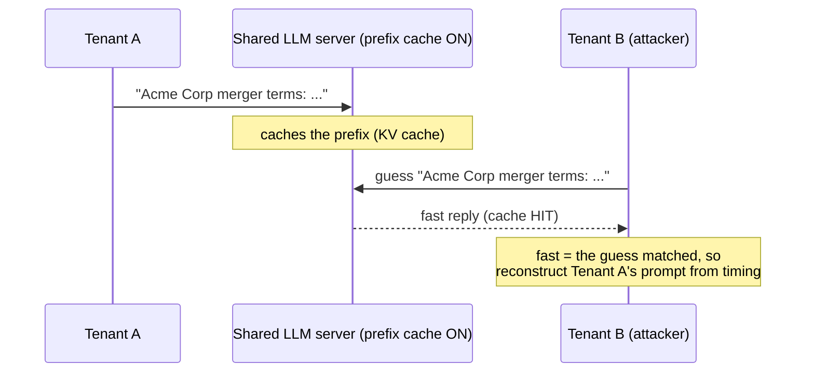

# TenantGuard


**Multi-tenant AI isolation audit.** Find out whether a multi-tenant AI product can leak data or
prompts **across tenants**, and produce a proof report the customer can hand to their own customers'
security reviewers.

Multi-tenant AI isolation is a verified-open *operational* problem: teams bolt it on piecemeal after
incidents, cross-tenant leaks are existential, and most teams cannot *prove* isolation when asked.
This kit makes it provable, fast. First vertical: **legal AI**, where attorney-client privilege makes
the fear, and the willingness to pay, highest.

## How the cross-tenant leak works
High-performance LLM servers cache prompt prefixes (KV cache) to go faster. If that cache is shared
across tenants, response *timing* becomes a side channel: a second tenant can confirm what a first
tenant asked, just by how fast the server replies (NDSS 2025: up to 99% prompt reconstruction).



### A live capture
`prefix_cache_check.py` run against a production-grade `gpt-oss-120b` endpoint:

```text
$ python audit/prefix_cache_check.py --base-url http://HOST/v1 \
      --tenant-a-key sk-tenant-A --tenant-b-key sk-tenant-B \
      --model gpt-oss-120b --trials 11 --prefix-tokens 6000

== Multi-tenant prefix-cache isolation check ==
[sanity] tenant-A cold=3564ms  warm-median=74ms   => caching OBSERVED
[cross]  tenant-B on tenant-A's prefix=74ms   vs   fresh control=129ms   ratio=0.57

VERDICT: FAIL
Tenant B got a strong cache speedup on tenant A's prefix => the prefix/KV cache is SHARED
across tenants => cross-tenant prompt inference is possible. Add per-tenant cache isolation.
```
Tenant B was served from Tenant A's cached computation (74 ms, identical to A's own warm time) while
a never-seen prompt took 129 ms. That gap is the leak.

## The ten-layer audit
Isolation in AI must hold at **every** layer of the request pipeline, which is what makes it harder
than database multi-tenancy. One weak layer breaks the whole guarantee.

```mermaid
flowchart LR
    R([request]) --> L1[1 auth and tenant id]
    L1 --> L2[2 tenant routing]
    L2 --> L3[3 RAG / data]
    L3 --> L4[4 prompt build]
    L4 --> L5[5 inference and cache]
    L5 --> L6[6 memory]
    L6 --> L7[7 tools]
    L7 --> L8[8 cost]
    L8 --> L9[9 logs]
    L9 --> L10[10 egress / DLP]
    L10 --> O([response])
```


Layer 5 is what `prefix_cache_check.py` tests live; the full checklist is in
[`audit/FRAMEWORK.md`](audit/FRAMEWORK.md).

## What is inside
- **[`audit/FRAMEWORK.md`](audit/FRAMEWORK.md)** , the repeatable ten-layer isolation assessment (the
  core method).
- **[`audit/prefix_cache_check.py`](audit/prefix_cache_check.py)** , a runnable, defensive
  cross-tenant cache-leak test. Detects whether an OpenAI-compatible endpoint shares its prefix/KV
  cache across tenants (NDSS-2025 timing side-channel).
- **[`audit/report_template.md`](audit/report_template.md)** , the client deliverable, including an
  isolation attestation section written to be forwarded to a security reviewer.
- **[`docs/cross-tenant-leak-explainer.md`](docs/cross-tenant-leak-explainer.md)** , a plain-language
  explainer of the risk for non-specialists.

## Quickstart (the cache check)
Run against a system you own or are authorized to test, with two tenant credentials:
```
python audit/prefix_cache_check.py \
    --base-url http://localhost:4000/v1 \
    --tenant-a-key sk-tenantA --tenant-b-key sk-tenantB \
    --model your-model
```
Stdlib only, no dependencies. Exit code 0 on PASS/INCONCLUSIVE, 1 on FAIL/REVIEW.

## The offering this supports
A productized service: a fixed-fee **Isolation Audit** -> a managed-operation retainer -> a packaged
per-tenant governance + observability product.

## Scope & ethics
The cache check is a **defensive** tool for the system owner. Only run it against infrastructure you
own or are explicitly authorized to test.

Status: v1 , the method, the runnable check, the report, and the explainer. Next: a per-tenant
governance proxy (the productized remediation) and per-tenant cost/quality observability.

## License
MIT , see [LICENSE](LICENSE).
