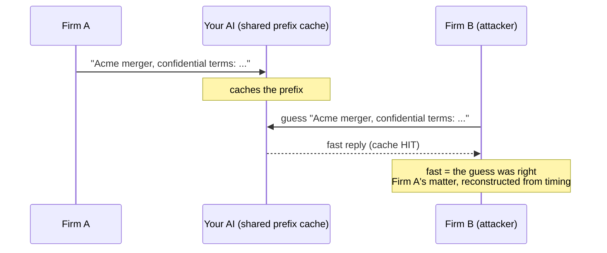

# Can your AI leak one law firm's data to another?

If your legal-AI product serves more than one firm from the same infrastructure, this is the
question their security team will ask before they sign. Most teams cannot answer it with evidence.
Here is why, and the five-minute version of how to check.

## The part nobody told you about
You almost certainly added an LLM feature fast, and you trusted two things to keep firms apart:
your database tenant boundaries, and your model provider's "we don't train on your data" contract.

Neither covers the AI layer. A 2025 security paper (NDSS) showed that when an LLM server shares its
**prefix cache** across tenants , which is on by default in most high-performance setups , an
attacker who is simply *another tenant on your platform* can **reconstruct another tenant's prompts
with up to 99% accuracy, using nothing but response timing.** No breach of your database. No access
to the other firm's account. Just timing.

For a legal product, that is not a bug. That is a privilege breach waiting to happen, and the firm
whose matter leaked will treat it as one.

## The contract does not save you
"Zero data retention" from OpenAI or Anthropic is about *the model provider* not keeping your data.
It says nothing about isolation *inside your own multi-tenant app* , your cache, your retrieval,
your memory, your logs. That boundary is yours to prove, and right now you probably cannot.

## Five questions to ask your team today
1. **Cache:** can two tenants share a prefix/KV cache? (If you do not set a per-tenant cache key, the
   answer is almost certainly yes.)
2. **Retrieval:** is every vector search filtered by tenant, with no global index?
3. **Tools:** do your AI's tools use per-tenant credentials, or one shared admin key?
4. **Memory:** is conversation and long-term memory keyed by tenant?
5. **Proof:** if a firm's security reviewer asked you to *demonstrate* isolation tomorrow, could you?

If you hesitated on any of these, you have an isolation gap , and so does the next firm's data.

## A live capture (this is not theoretical)
We pointed our audit tool at a production-grade LLM inference endpoint and asked one question: does
it share its prefix cache across tenants? The timing told the whole story:

- The endpoint cached aggressively: the same long prompt went from **3,564 ms cold to 74 ms warm**.
- Then a **second tenant** sent the **first tenant's** prompt. It came back in **74 ms** , identical
  to the first tenant's cached time , while a brand-new prompt took **129 ms**.
- Ratio 0.57. The second tenant's request was served from the **first tenant's cached computation.**

The cache was shared across tenants. That is the default behavior of high-performance LLM serving,
and it is exactly the channel an attacker uses to reconstruct another tenant's prompts from timing
alone. The fix (per-tenant cache keys) takes an afternoon. Finding out you needed it *after* a firm's
data leaked does not.

## Prove it in an afternoon
We run a ten-layer **Multi-Tenant AI Isolation Audit** built for legal AI: we trace one real request
end to end, run a live cross-tenant cache-leak test against your endpoint, and hand you a report you
can give straight to a firm's security team. Confidentiality stops being your risk and becomes a
reason firms choose you.

**[Book the audit]** , or grab the free isolation checklist first.
